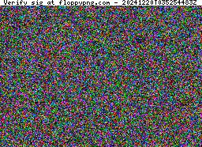

# Floppy PNG Generator

## Usage 

This is an ES module. Import:

```javascript
import { fpng } from "fpng"
```

Call function:

```plaintext
fpng(<text to embed>,<domain for label>,<timestamp>)
```
fpng returns a Uint8Array of a PNG image.

Example:


